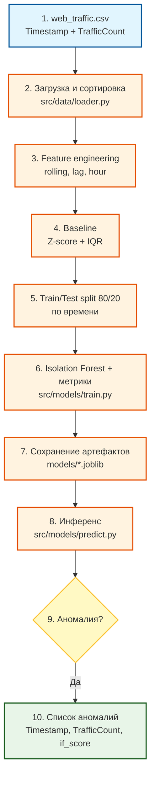

# Архитектура: Log Anomaly Detector

**Задача:** детекция аномалий в веб-трафике (Вариант 4 — аномалии в логах сервера)  
**Датасет:** `web_traffic.csv` — `Timestamp`, `TrafficCount`  
**Подход:** статистический baseline (Z-score, IQR) → Isolation Forest (2 итерации)

---

## Data Flow (Mermaid)



Схему можно открыть и отредактировать в [mermaid.live](https://mermaid.live).

---

## Компоненты системы

| № | Компонент | Модуль | Описание |
| :---: | :--- | :--- | :--- |
| 1 | Сырые данные | `web_traffic.csv` | Временной ряд веб-трафика |
| 2 | Загрузка | `src/data/loader.py` | Чтение CSV, сортировка по `Timestamp` |
| 3 | Препроцессинг | `src/data/preprocessor.py` | Rolling mean / std (`window=24`) |
| 4 | Признаки | `src/data/feature_engineering.py` | `hour`, `lag`, `pct_change` |
| 5 | Baseline | `src/models/baselines.py` | Z-score и IQR — статистические детекторы |
| 6 | Split | `src/models/train.py` | Хронологическое разделение 80/20 |
| 7 | ML-модель | `src/models/isolation_forest.py` | Обучение IF, подбор порога `if_score` |
| 8 | Оценка | `src/models/evaluator.py` | Precision, Recall, F1 |
| 9 | Инференс | `src/models/predict.py` | Предсказание по сохранённой модели |

---

## Точки входа

| Команда | Назначение |
| :--- | :--- |
| `python -m src.models.train` | Обучение, метрики, сохранение модели |
| `python -m src.models.predict` | Применение модели к данным |

---

## Артефакты

После `python -m src.models.train` сохраняются:

| Файл | Содержимое |
| :--- | :--- |
| `models/isolation_forest.joblib` | Обученная модель |
| `models/score_threshold.joblib` | Порог `if_score` (итерация 2) |
| `models/feature_columns.joblib` | Список признаков |
| `config.yaml` | Параметры эксперимента (`random_state`, `window`, …) |

---

## Две итерации ML

```text
Итерация 1: Isolation Forest + contamination
    → высокий Precision, низкий Recall

Итерация 2: Isolation Forest + порог if_score (подбор на train)
    → лучший F1 на test
```

---

## Промпты ИИ (использовались при проектировании)

| Что | Промпт |
| :--- | :--- |
| Архитектурная схема | «Создай Mermaid data flow diagram для проекта детекции аномалий в веб-трафике. Покажи: загрузка CSV, препроцессинг, baseline Z-score/IQR, train/test split, Isolation Forest, predict.» |
| Гипотеза | «Ты — ML-архитектор. Мы решаем задачу детекции аномалий в логах сервера. Опиши: цель, target, features, тип модели, метрику качества.» |
| Код эксперимента | «Напиши Python-пример Z-score / IQR и Isolation Forest для временного ряда TrafficCount с engineered-признаками.» |
| Структура репозитория | «Оформи проект: src/data, src/models, config.yaml, train.py, predict.py.» |
| MD-документация | «Создай md-файл [название, например: architecture.md / ml_experiment_checklist.md] для ML-проекта по детекции аномалий в веб-трафике. Структура: цель проекта, гипотеза (target + features), пайплайн data flow, таблицы компонентов и метрик, выводы по эксперименту, чек-лист по критериям сдачи. Формат — markdown с таблицами и Mermaid-схемой.» |
| Чек-лист прогресса | «На основе файла final_project_req.md создай md-чек-лист для отслеживания прогресса ML-проекта. Разбей по блокам 1–3 (репозиторий, ML-эксперимент, защита). Для каждого критерия: чекбокс, статус, комментарий по нашему проекту, ссылки на файлы. Добавь сводную таблицу.» |
